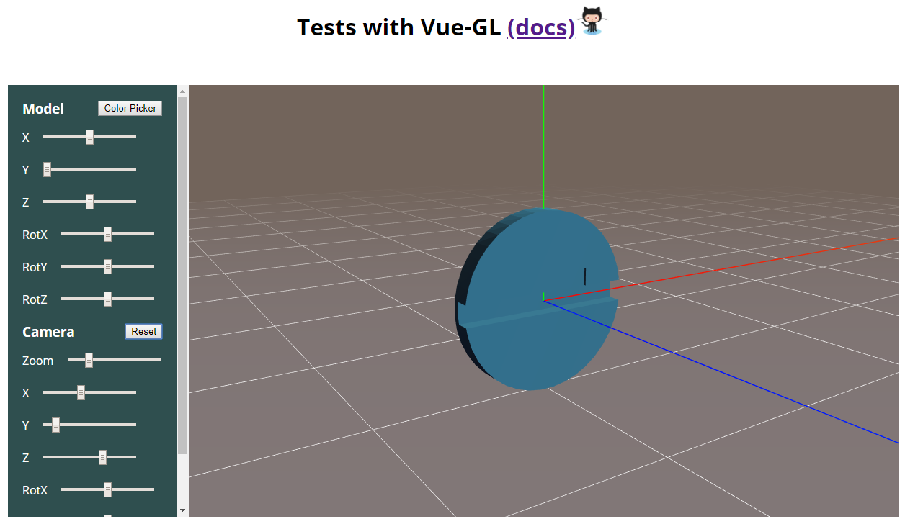

# webgl-area-picking-vue

## Description

Project based on ThreeJS and Vue-GL.
Environment based on Vue-CLI 3, Typescript, and class syntax Vue.

Monolithic untyped version can be found in `testIndex.html`.



## Features

- Bi-directionally reactive properties `position` and `rotation`, either from sliders' DOM events or from the OrbitControl's mouse events.
- Resetable
- Async loading of model3D
- Color Picker for the model3D

## Project setup

```sh
yarn
```

### Compiles and hot-reloads for development

```sh
yarn start
```

### Compiles and minifies for production

```sh
yarn build
```

### Run your tests

```sh
yarn test
```

### Lints and fixes files

```sh
yarn lint
```

### Customize configuration

See [Configuration Reference](https://cli.vuejs.org/config/).
